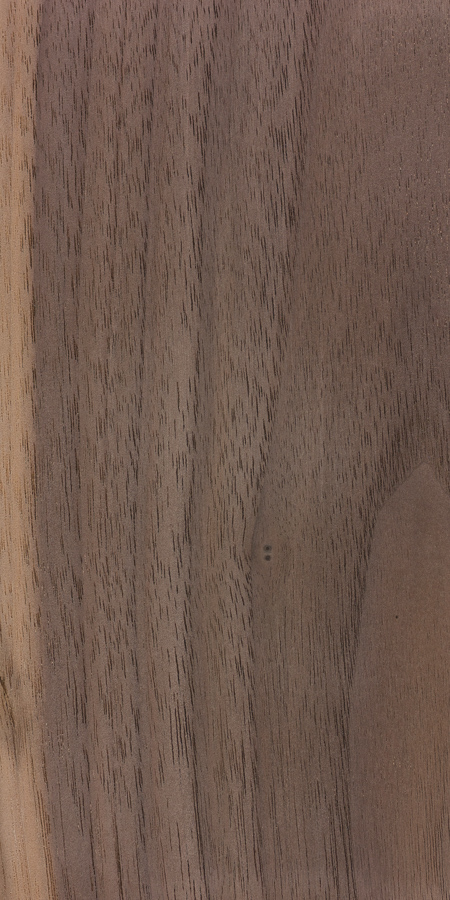
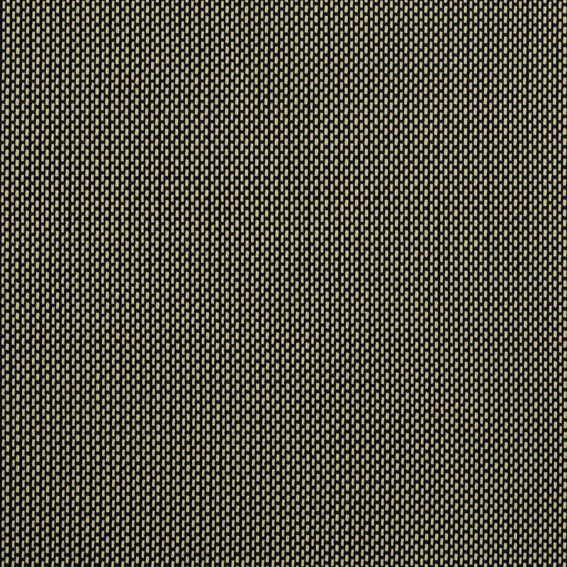

<!--
MaximoCabs voice, from the site on 2026-09-11. Write the four slots in this register:
  "Custom cabinets, built to your sound"
  "We treat every order as an acoustic brief. Two 1x12 cabinets, one in tolex, one in hardwood, each tuned to the amp you actually play and the rooms you actually play in."
  "Tailored, not configured."
  "Tell us your amplifier, the style you play, and the rooms you work in. We design the internal volume, port, and baffle around it. Defaults exist; specs do not."
  "Void-free Baltic birch ply in the Tolex, solid resawn hardwood in the Hardwood. Hand-cut joinery. Felt-isolated floating baffles. Nothing decorative."
  "Every cabinet is built start-to-finish by one builder. Lead times reflect that."
Rule: nothing in this proposal is a measured claim. Say what the cabinet is designed for; never quote a frequency, a decibel, or a test result.
Edit only between the slot markers. Every line outside them is a fact from cab.json and voicing.json that `cabreport.py --verify` checks.
-->

# Your MaximoCabs Hardwood 1x12

Prepared for Cecilia Blietz.

## 1. Your rig and goals

<!-- slot: rig_and_goals -->
You play a Dr. Z MAZ 38, a 38 W amp with four EL84 power tubes, with humbuckers into two Tube Screamers: rock, funk, and country, at the edge of breakup. The amp runs at about 20 percent volume in a practice room, just past clean, so most of the drive comes from the pedals, and the cabinet sits on the floor and fills the room on its own rather than through a microphone. In your words: "Crisp leads with milky high notes and noticable low end." You asked for an open back in walnut. The cabinet plugs into the MAZ 38's 8 ohm output and is the amp's only load.
<!-- /slot -->

## 2. The recommended cabinet

- Cabinet: Hardwood 1x12, open-back
- Configuration: 1x12
- Speaker: Eminence Cannabis Rex 12
- Impedance and wiring: Single driver, 8 ohm
- External size, width x height x depth: 20 x 18 x 11 in (508 x 457 x 279 mm)
- Estimated weight, loaded: 31.9 lb (14.5 kg)

<!-- slot: why_this_cabinet -->
- Speaker: the Eminence Cannabis Rex, 8 ohm. Its balanced low end, neutral mids, and smooth top suit a bright EL84 amp: the neutral mids leave room for what two Tube Screamers already add, and the smooth top is chosen for the warm, rounded high notes you describe. At 50 W it is comfortable under a 38 W amp at practice volume.
- Back type: open, as you asked. An open back spreads the sound across the room instead of throwing it forward, which is what a cabinet filling a practice room by itself, with an amp at the edge of breakup, wants.
- Size: our standard 20 x 18 x 11 in box. With an open back the low end comes from the speaker, the floor, and the room rather than from a tuned internal volume, so the standard size serves it. The walnut shell is joined with hand-cut finger joints, the grain wrapping around the box.
<!-- /slot -->

## 3. What it is designed to do

<!-- slot: designed_to_do -->
This cabinet is designed to fill a practice room from the floor at low volume, with the sound spread wide so the amp sounds full across the room rather than only in front of the speaker. It is designed for crisp, articulate leads over humbuckers with a smooth, rounded top, so a bright EL84 amp and two Tube Screamers stay sweet rather than harsh. It is designed to keep a noticeable low end, drawn from the speaker, the floor, and the room, lighter and airier than a closed cabinet would give. And it is designed to move with the seasons as one piece: the grain wraps around the box, and the baffle floats on felt-lined cleats.
<!-- /slot -->

## 4. Alternatives considered

<!-- slot: alternatives -->
- Celestion G12M-65 Creamback (65 W): a similar balanced, smooth voice with more forward mids and more headroom; our data for it is thinner, so its cabinet would be sized by rule of thumb.
- Celestion Vintage 30 (60 W): a favorite with boutique amps, with more forward mids and more clean headroom, which makes it a harder voice for edge-of-breakup leads.
- A semi-open or closed back: closing more of the back (semi-open) keeps most of the spread with more low end, and a closed, ported back gives the most low end and punch but projects forward instead of filling the room; you asked for open.
<!-- /slot -->

## 5. Finishes

- Finish: Walnut
- Grill cloth: Salt and Pepper, 32"
- Hardware: No metal corners, strap handle, recessed brass jack plate, no piping, rubber feet.

<!-- Swatches: copy the files named below from ~/ClaudeProjects/MaximoCabs/public/materials/ (tolex/, grill-cloth/, wood/) into this order's images/ folder. -->

## 6. Lead time and price

- Lead time: 10 to 14 weeks from confirmed order
- Price:

Every figure in this proposal is a design target, not a measurement. Prediction status: unverified, ears only.
