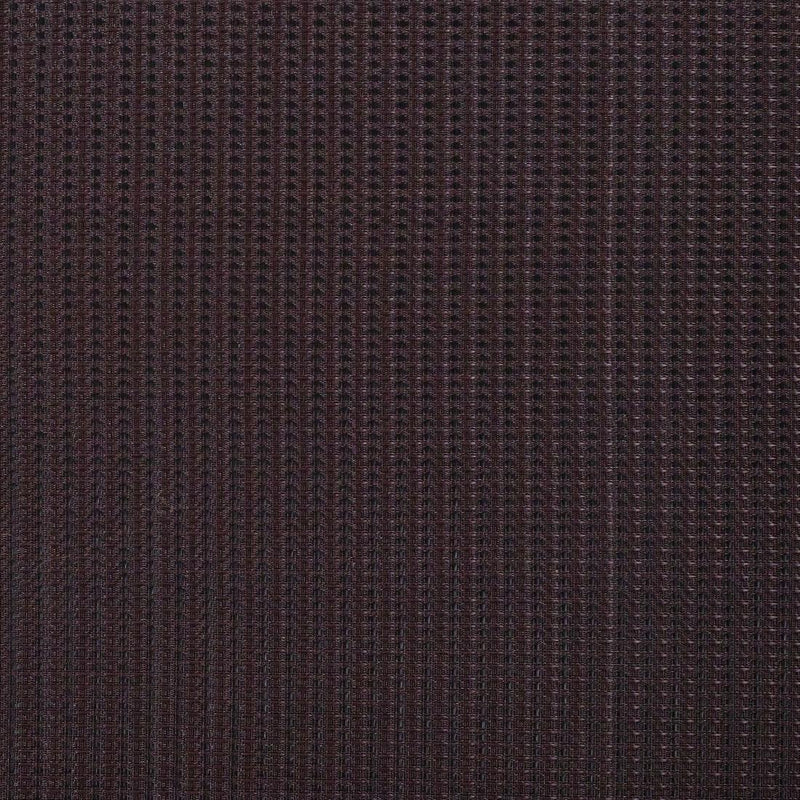

<!--
MaximoCabs voice, from the site on 2026-09-11. Write the four slots in this register:
  "Custom cabinets, built to your sound"
  "We treat every order as an acoustic brief. Two 1x12 cabinets, one in tolex, one in hardwood, each tuned to the amp you actually play and the rooms you actually play in."
  "Tailored, not configured."
  "Tell us your amplifier, the style you play, and the rooms you work in. We design the internal volume, port, and baffle around it. Defaults exist; specs do not."
  "Void-free Baltic birch ply in the Tolex, solid resawn hardwood in the Hardwood. Hand-cut joinery. Felt-isolated floating baffles. Nothing decorative."
  "Every cabinet is built start-to-finish by one builder. Lead times reflect that."
Rule: nothing in this proposal is a measured claim. Say what the cabinet is designed for; never quote a frequency, a decibel, or a test result.
Edit only between the slot markers. Every line outside them is a fact from cab.json and voicing.json that `cabreport.py --verify` checks.
-->

# Your MaximoCabs Hardwood 1x12

Prepared for Shahir ElShaieb.

## 1. Your rig and goals

<!-- slot: rig_and_goals -->
Your Ceriatone Overtone Special 50 carries a Les Paul's humbuckers and a Strat's single coils through a TS808, a Klon, and a germanium fuzz - slightly overdriven cleans up through pushed drive into heavier saturation, mostly at studio and outdoor volumes on the low side. You asked for a pretty cabinet in real wood with some girth and warmth, not too strident, and pointed us at the Mesa Boogie 1x12 WideBody as the shape you had in mind, built in hardwood instead.
<!-- /slot -->

## 2. The recommended cabinet

- Cabinet: Hardwood 1x12, open-back
- Configuration: 1x12
- Speaker: Weber Silver Bell, Alnico, hemp cone, 75 W
- Impedance and wiring: Single driver, 16 ohm
- External size, width x height x depth: 22-3/4 x 16-1/2 x 12-13/16 in
- Estimated weight, loaded: 31.9 lb (14.5 kg)

<!-- slot: why_this_cabinet -->
We built this open-back, matched to the WideBody's own proportions - Mesa widened that shape specifically to add low-end fullness to an open-back cab without losing its natural sparkle, which is the direction your girth-and-warmth brief points. For the speaker, we chose the Weber Silver Bell in its hemp-cone version: hemp is built for a warmer, mellower top end than a standard paper cone, staying out of the way of strident highs while your dirt pedals do their work.
<!-- /slot -->

## 3. What it is designed to do

<!-- slot: designed_to_do -->
This cabinet is designed for a player who moves between clean headroom and real drive without switching rigs - open enough to breathe and fill a room on its own, full enough in the low end to stay out from under it at the edge of breakup, and voiced to sit warm and smooth rather than bright under a humbucker and a fuzz pedal.
<!-- /slot -->

## 4. Alternatives considered

<!-- slot: alternatives -->
You also mentioned the EVM12L - a speaker with serious headroom that a lot of Dumble-style amps are built around, but one that tends to read cleaner and more forward than warm, which is why we steered toward the Silver Bell for this build. On construction, the alternative to the finger-jointed corners we're using is a through-dovetail joint - a visible, hand-cut option some players choose for a more furniture-grade look, available if you'd like to see it priced.
<!-- /slot -->

## 5. Finishes

- Finish: Walnut
- Grill cloth: Fender Style Oxblood, 36"
- Hardware: No metal corners, strap handle, recessed brass jack plate, with piping, rubber feet.

<!-- Swatches: copy the files named below from ~/ClaudeProjects/MaximoCabs/public/materials/ (tolex/, grill-cloth/, wood/) into this order's images/ folder. A name prefixed with its folder is the file <folder>/<rest of the name> copied under the prefixed name: images/tolex-fender-black.jpg is tolex/fender-black.jpg. -->

## 6. Lead time and price

- Lead time: 10 to 14 weeks from confirmed order
- Price:

Every figure in this proposal is a design target, not a measurement. Prediction status: unverified, ears only.
