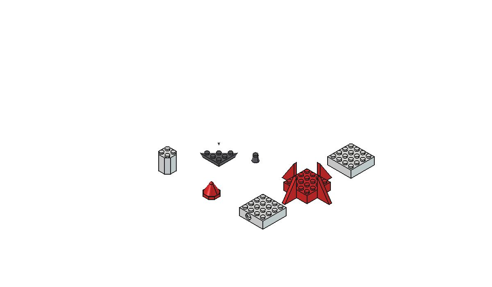
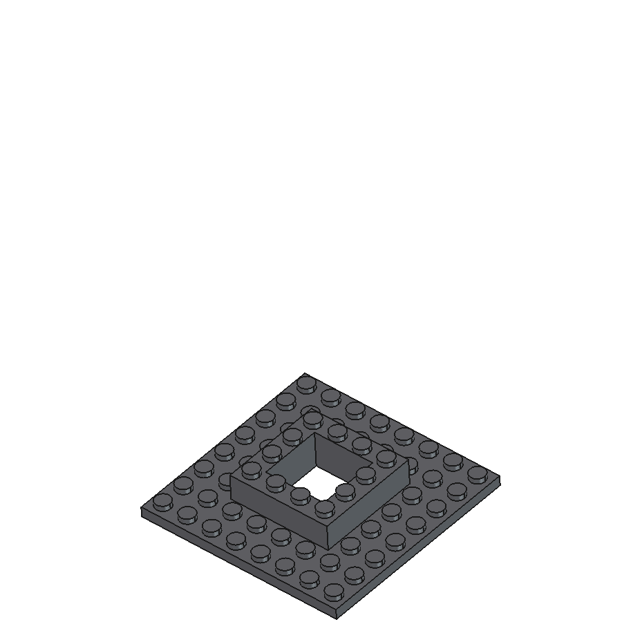
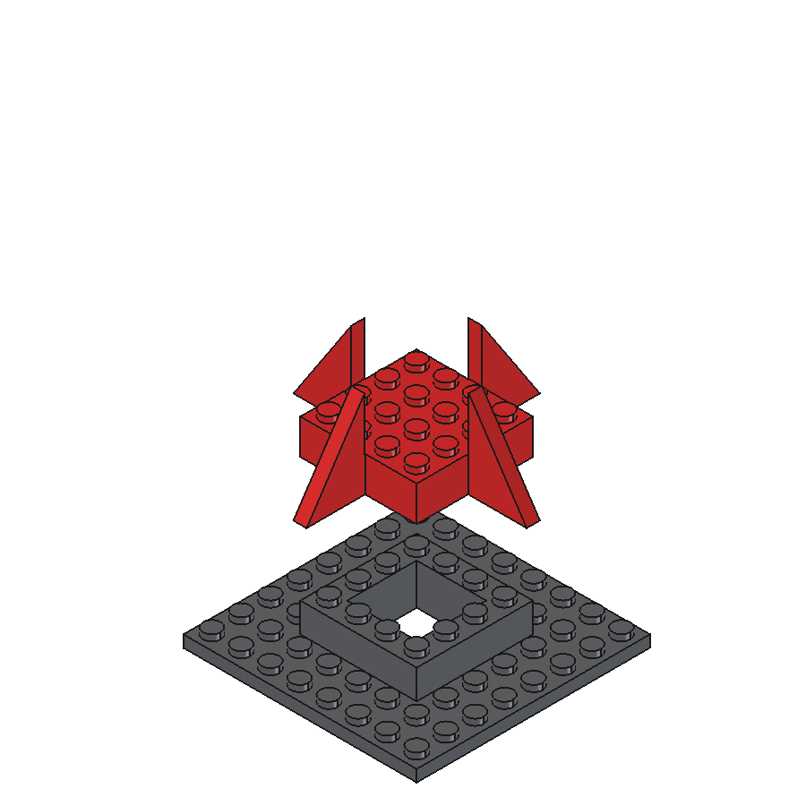
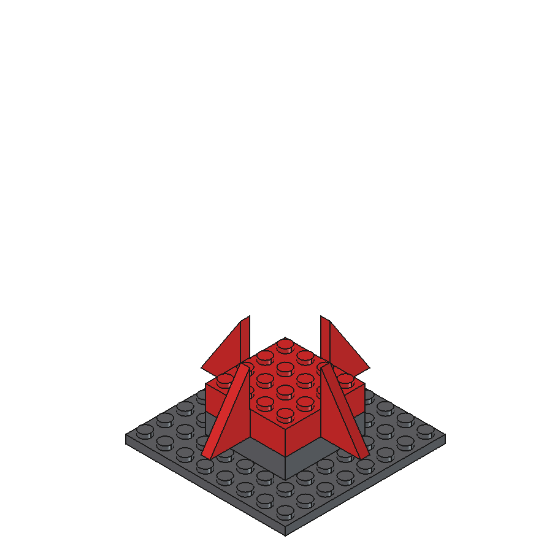
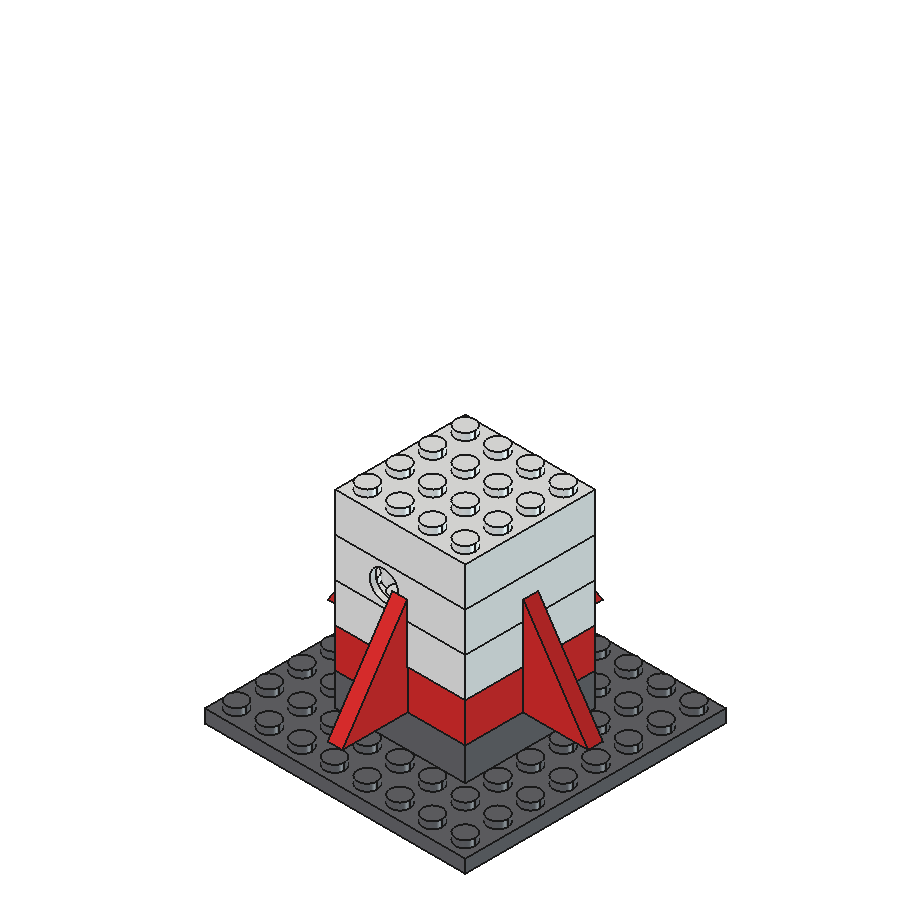
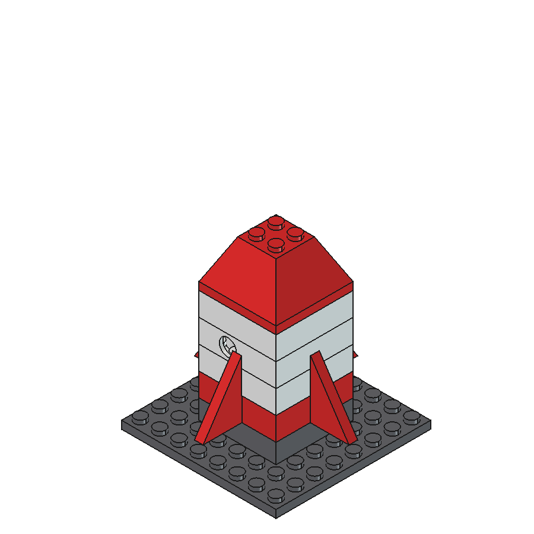
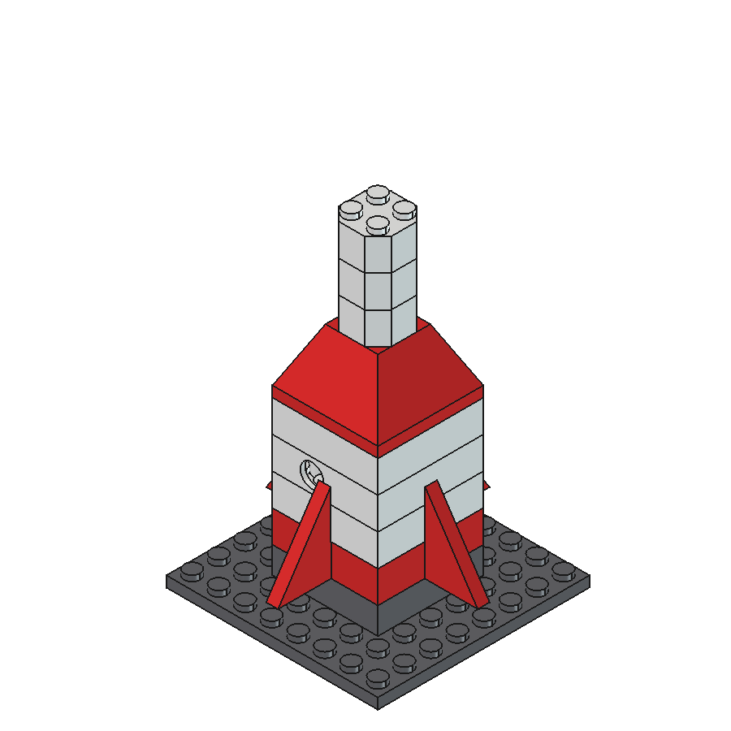
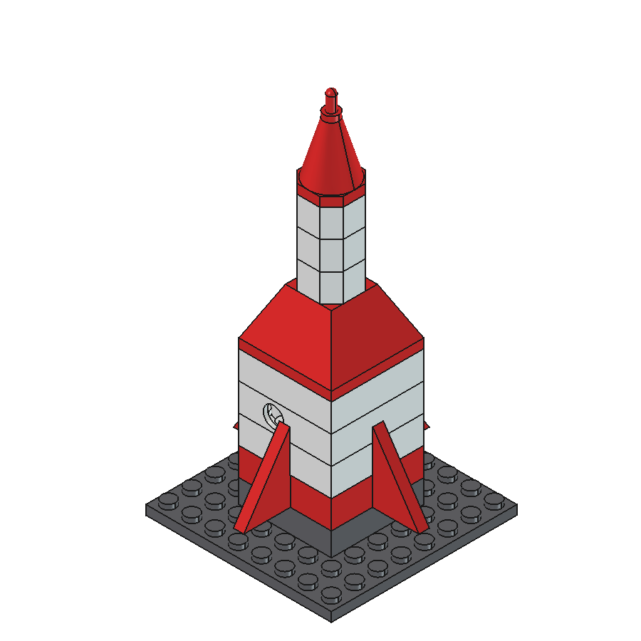
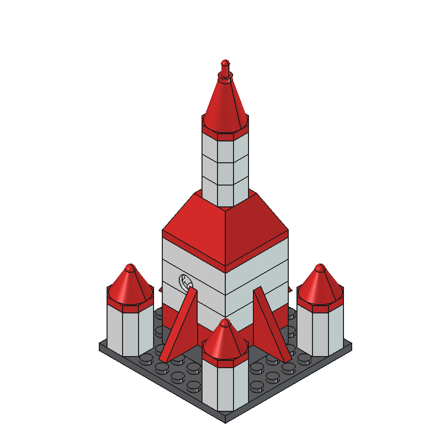

# Lego Rocket Mk2 — Build Instructions

A 22-piece Lego-compatible multi-stage rocket on a launch pad with four side
boosters. 127mm tall on the pad. Standard Lego geometry (8mm pitch, 4.8mm
studs) throughout, so every part is compatible with real Lego.

## Kit contents (22 parts, 10 unique designs)

| Qty | Part | Color |
|-----|------|-------|
| 1 | Launch pad (8x8 plate, raised platform, bell well) | Dark gray |
| 4 | Engine bell (plugs into tail underside) | Dark gray |
| 1 | Tail section (4x4 brick, four tall fins) | Red |
| 2 | Body brick 4x4 | White |
| 1 | Porthole brick (4x4, round windows both sides) | White |
| 1 | Taper adapter (4x4 to 2x2, two bricks tall) | Red |
| 3 | Second-stage octagonal 2x2 brick | White |
| 1 | Nose cone (cone + antenna mast + domed tip) | Red |
| 4 | Booster body (octagonal, two bricks tall) | White |
| 4 | Booster cone | Red |

## Printing

- **Files:** `lego-rocket-mk2.3mf` (Bambu Studio project: all 22 parts
  arranged, filament 1 = red, 2 = white, 3 = dark gray) or the 10 per-part
  STLs.
- **Orientation:** as arranged — everything flat on the bed, studs up.
  No supports. Engine bells print exhaust-down.
- **Settings:** X2D 0.6mm nozzle, 0.18mm layers, PLA. Enable
  **elephant foot compensation (~0.15mm)** — underside cavities are the fit
  surfaces.
- **Fit:** cavities carry +0.1mm compensation. Too tight: sand stud tops.
  Too loose: reprint bricks at 100.5% XY.

## Assembly

| Step | Action |
|------|--------|
| 1 | Set the **launch pad** down, platform up.  |
| 2 | Push the four **engine bells** stud-first into the underside of the red **tail section**. Each bell grips between four tubes.  |
| 3 | Seat the tail section on the platform ring. The bells hang into the well.  |
| 4 | Build the first stage: **body brick**, then the **porthole brick** (windows facing out), then the second **body brick**.  |
| 5 | Add the red **taper adapter**.  |
| 6 | Stack the three **octagonal second-stage bricks**.  |
| 7 | Cap with the **nose cone**.  |
| 8 | Mount the four **boosters** (body + cone) on the pad corners. Liftoff.  |

## Design notes

- Octagonal bricks keep full Lego clutch: the cavity corners are chamfered
  to match, leaving 1.34mm walls on the diagonals.
- Engine bells grip the tail's internal tubes the same way real Lego studs
  grip between four tubes.
- The tall fins overlap the first-stage walls with 0.15mm clearance.
- The rocket displays on its pad; off-pad, remove the bells to stand it on
  its fins.
- Source: `lego-rocket-mk2.FCStd` (parts + full assembly documents).
