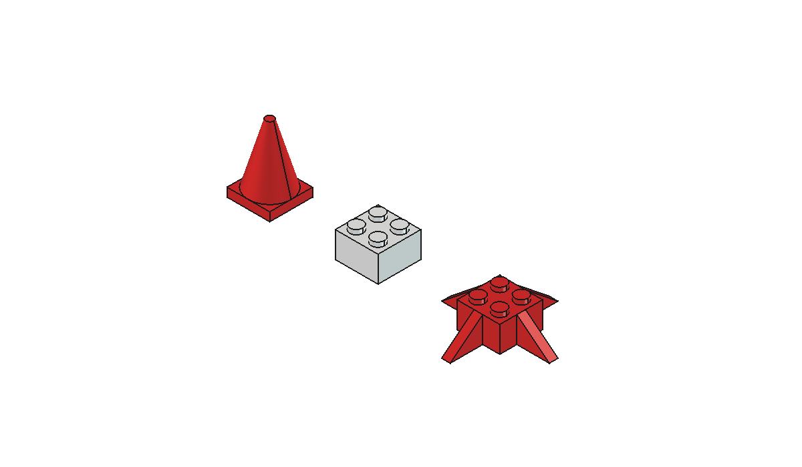
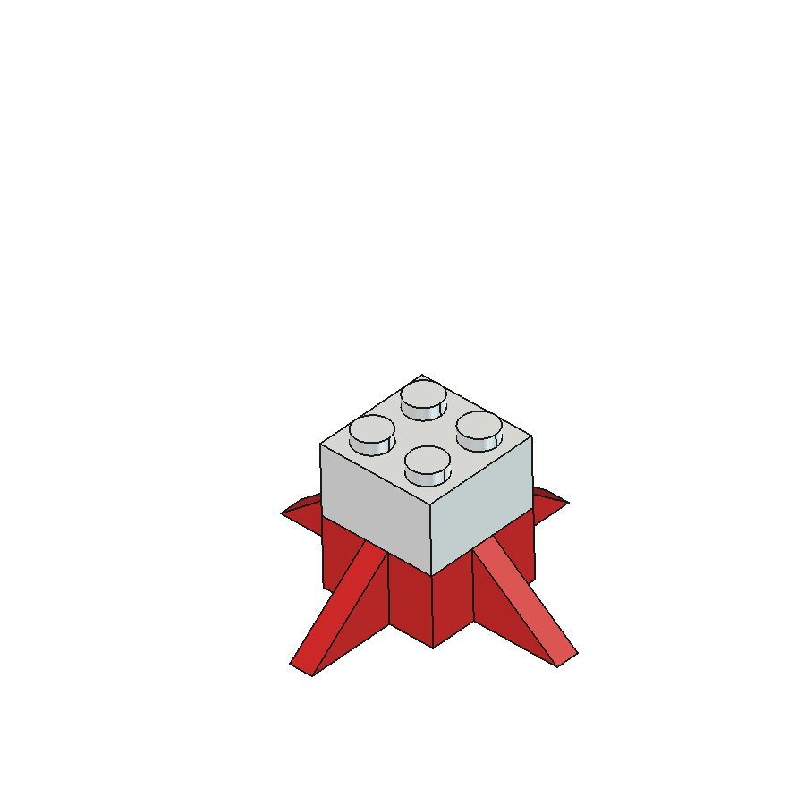
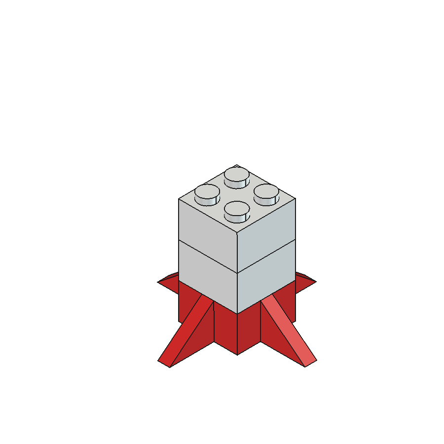
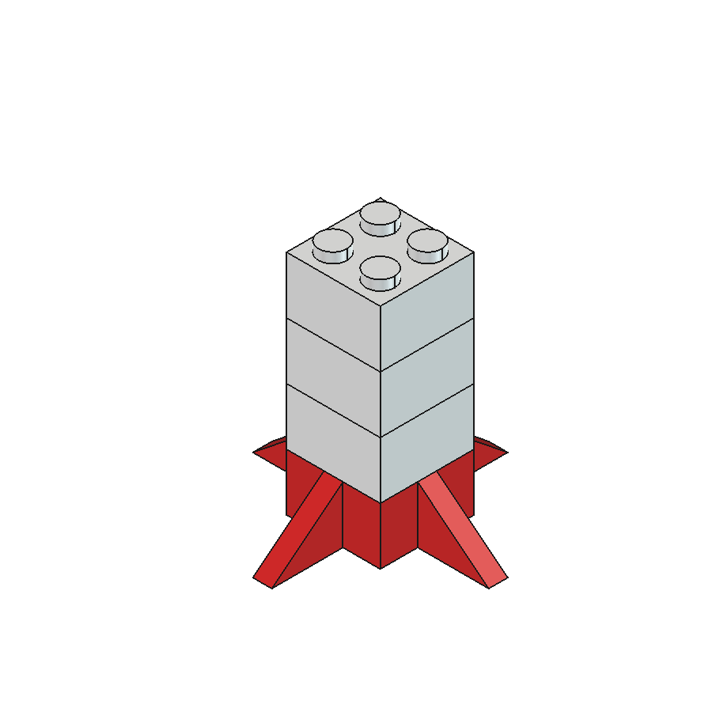
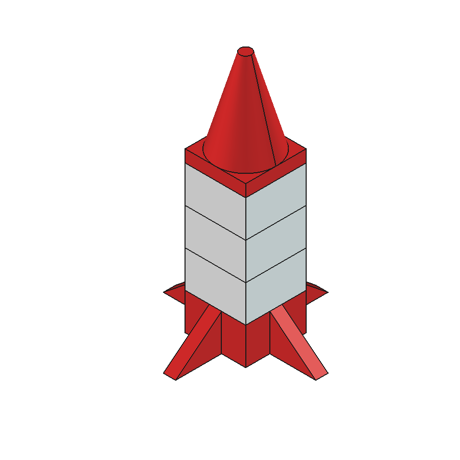

# Lego Rocket Kit — Build Instructions

A 5-piece Lego-compatible rocket, 63.6mm tall assembled. Parts snap together
with standard Lego clutch (4.8mm studs, 8mm pitch) and are compatible with
real Lego bricks.

## Kit contents

| Qty | Part | Color | Size |
|-----|------|-------|------|
| 1 | Fin Base (2x2 brick + 4 fins) | Red | 39.8 x 39.8 x 9.6 mm |
| 3 | Body Brick (2x2) | White | 15.8 x 15.8 x 11.3 mm |
| 1 | Nose Cone (2x2 skirt + cone) | Red | 15.8 x 15.8 x 25.2 mm |

## Printing

- **Files:** `lego-rocket.3mf` (Bambu Studio project: all 5 parts arranged,
  filament 1 = red, filament 2 = white) or the per-part STLs
  (`fin-base.stl`, `body-brick.stl` x3, `nose-cone.stl`).
- **Orientation:** as arranged — every part flat on the bed, studs up.
  No supports.
- **Settings:** X2D 0.6mm nozzle, 0.18mm layers, PLA. Enable
  **elephant foot compensation (~0.15mm)** — the underside cavities are the
  fit surfaces and a squished first layer makes them tight.
- **Fit note:** cavities include +0.1mm FDM compensation. If the fit is too
  tight, lightly sand the stud tops or scale studs down 1%; if too loose,
  reprint bricks at 100.5% XY.

## Assembly

| Step | Action |
|------|--------|
| 1 | Place the red **Fin Base** on the table, fins down, studs up.  |
| 2 | Press a white **Body Brick** onto the Fin Base studs.  |
| 3 | Press the second **Body Brick** on top.  |
| 4 | Press the third **Body Brick** on top.  |
| 5 | Cap the stack with the red **Nose Cone**. Liftoff.  |

## Design data

- Standard Lego geometry: 8mm pitch, 15.8mm 2x2 footprint, 9.6mm brick
  height, 4.8mm studs (1.7mm tall), 6.5mm solid center tube.
- Cavities 12.9mm square (spec 12.8 + 0.1 print compensation), 1.45mm walls.
- Source: `lego-rocket.FCStd` (documents: parts + stacked assembly).
